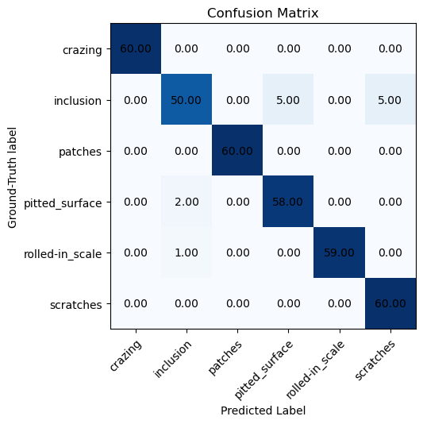
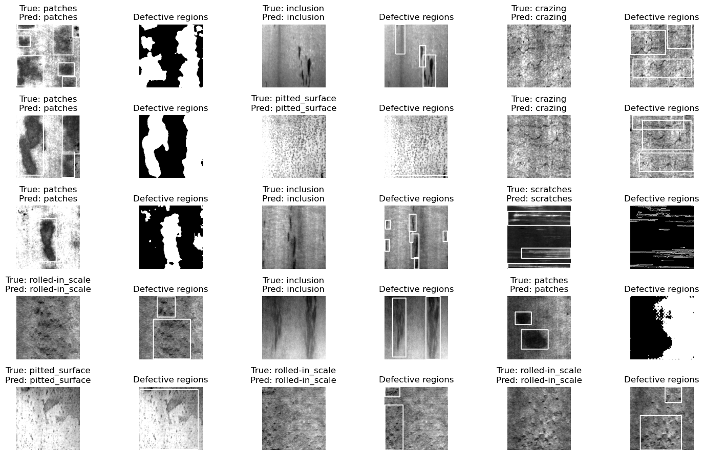

# Surface Defect-detection and Localization using ResNet and Classical Computer Vision

## Project Environment

This repository is tested on Ubuntu 22. To use this repository, please follow these steps:

- Make sure [anaconda](https://www.anaconda.com/docs/getting-started/anaconda/install) is installed.
- Clone this repository or download as a zip.
- Make sure your system has Anaconda installed. Open a terminal to the root directory and enter the following command:
`conda env create -f environment.yml`
This will create a conda environment with the required libraries.
- After the required libraries have been installed, type `conda activate defect_detection` in your terminal to activate the newly created environment.

## Dataset

The dataset used for this project is the [NEU Surface Defect Database](https://www.kaggle.com/datasets/kaustubhdikshit/neu-surface-defect-database). The dataset can be downloaded directly from the site, however, an annotation belonging to the training set is erroneously kept in the validation directory. Please execute the following steps to download and organize the dataset.

### Install Kaggle API

Enter the following in your terminal.

`pip install kaggle`

### Install unzip if not already installed

`sudo apt-get install unzip`

### Execute download_data.sh

`bash download_dataset.sh`

## Training

The provided notebook can train, validate and visualize, given the dataset is in the correct directory. To train, please uncomment the training block in the notebook.

## Project Overview

In this project, we
1. Detect the type of defect.
2. Build a method of localizing the defects on the images. The localization method depends on the defect-type.

Step 1 consists of fine-tuning a ResNet-18 to detect defect types. The ResNet-18 works reasonably well as shown by the confusion matrix below.

  

Step 2 is currently under progress. At the time of writing this document, methods for localizing defects have been developed for only 2 of the 6 defect types: patches and scratches.

Steps 1 and 2 for 15 random images from the validation set are shown below.

  

The boxes in images are generated using the annotations provided by the dataset - they were not determined as a part of this project. The defective regions are shown for the patches and scratches.

## Defect-localization Methods

### Crazing

Not yet implemented.

### Inclusion

Not yet implemented.

### Patches

The patches are determined using active contours. For simplicity, we use the Chan-Vese active contours from [scikit-image](https://scikit-image.org/docs/stable/auto_examples/segmentation/plot_chan_vese.html).

### Pitted Surface

Not yet implemented.

### Rolled-in Scale

Not yet implemented.

### Scratches

Given the high-contrast nature of the images, the scratches can be adequately localized by simply using an edge-detector. This work uses the Canny edge detector.